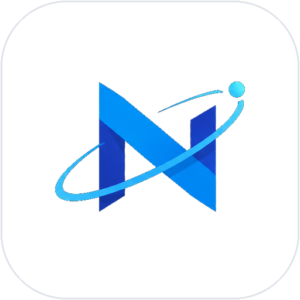

# Nexus Reach



One website for the whole lead pipeline: **find → enrich → judge fit → draft → send → follow up**.
It replaces the three separate tools (lead scraper, enrich/filter scripts, Outreach Desk) with one app,
one database and one lead format.

## Quick start

```bash
cd nexus-reach
python3 -m venv .venv && source .venv/bin/activate      # Windows: .venv\Scripts\activate
pip install -r requirements.txt
python3 -m playwright install chromium                    # only needed for scraping
cp .env.example .env                                      # Windows: copy .env.example .env
python3 app.py                                            # open http://localhost:5000
```

On first visit you'll see a **Create account** page. The first account becomes the **admin** and
automatically adopts any `hub.db` you already had, so nothing you built is lost.

The app starts with **no keys at all**. Each feature switches on when its key is added under
**Settings → Connections** (or, for the admin, in `.env`). Fastest useful setup: one free AI key
(Groq or Gemini) → drafting and fit-judging work; add your Gmail address + an App Password → emails send.

## The tabs

| Tab | What it does |
|---|---|
| **Dashboard** | Everything at a glance: counts, the next thing worth doing, all campaigns, budgets, recent jobs. |
| **Campaigns** | One card per campaign. Click one for **its own dashboard**: funnel (leads → in play → contacted → replied → qualified → won), reply/win rates, what needs doing (with one-click buttons scoped to that campaign), a 14-day activity chart, who's in it, recent activity and runs, plus the campaign's own settings. |
| **Find leads** | Import any CSV (Outscraper, Instant Data Scraper, your sheets; columns auto-matched). Or scrape Google Maps / Yelp / Instagram, one-off or on a schedule. |
| **Enrich & judge** | *Enrich* fills missing emails, socials, websites, owner names. *Judge* has an LLM mark each lead Fits / Rejected using criteria you edit per campaign. |
| **All leads** | Search, filter, bulk actions, export. Click a row for the full record, message editor and activity timeline. |
| **Outreach** | Draft messages, send emails (paced, capped, warmed up), check replies, send follow-ups, and work the hand-send queue (Yelp / Facebook / Instagram / SMS). |
| **Settings** | About you, templates, channel order, email limits, do-not-contact list, connection status. |

Long jobs (scrape, enrich, judge, draft, send) run in the background with a progress bar and a Stop
button. Everything is saved lead-by-lead, so stopping or crashing loses nothing; run it again and it
carries on with what's left.

## Accounts, and where each person's data lives

Anyone can have an account; **each person gets their own separate database file**, so one person's
leads, campaigns, templates and settings can never appear in another's.

```
data/accounts.db     who can sign in (email + hashed password) and each person's encrypted keys
data/users/1.db      person 1's leads, campaigns, jobs, settings ...
data/users/2.db      person 2's ...
data/secret_key      signs logins and encrypts saved keys  (or set SECRET_KEY yourself)
```

- **Their own credentials.** Each person adds their own AI key, Gmail App Password, SerpAPI key and Instagram login
  under Settings → Connections. They're stored encrypted, only used for that person, and never sent back to the browser.
  Nobody sends email from anyone else's mailbox. (The admin's `.env` keys are just a fallback for the admin; set
  `SHARE_LLM_WITH_USERS=1` if you want to lend everyone your AI key.)
- **Background jobs run as the person who started them,** in their database with their keys, including the scheduler.
- **Signing up:** open by default. Set `SIGNUP_CODE=something` to make it invite-only, or `ALLOW_SIGNUP=0` to close it.
- **Admin:** the first account. Settings shows everyone using the server (with lead counts) and can delete accounts.
- **Forgot your password?** There's no reset email. Run `python3 manage.py reset-password you@example.com` on the server.
  (`manage.py` also lists users, creates them and makes admins.)
- Back up the **whole `data/` folder**, not just one file.

## Campaigns

A campaign is one push at one audience ("dallas-hvac", "houston-roofers"). Create one on the Campaigns tab, or just type a
campaign name when importing/scraping and it's created for you. Names aren't case-sensitive.

Each campaign has its own leads, dashboard and (optionally) its own **fit criteria, About-you text, message templates and
channel order**. Anything a campaign leaves blank falls back to your account-wide Settings. Archiving hides a campaign from the
pickers without deleting anything; deleting keeps its leads (un-tagged) unless you also choose to delete them.
Email daily limits stay account-wide, since Gmail limits the mailbox, not the campaign.

## What changed from the three old tools

**One lead format** (`schema.py`): one set of field names; phones stored as `+12145550100` (US first;
change with `DEFAULT_COUNTRY_CODE`); social profiles as full URLs; one stage list
(`new → contacted → replied → qualified → won / lost / dead`); ISO timestamps; one ID that never changes.

**Mismatches that are now gone**
- Enrichment fills blank *cells*, never skips a column, never overwrites, and doesn't search for what you already have.
- The scraper keeps each listing's URL (`yelp_url`, `google_maps_url`) and decodes Yelp/Instagram redirect links to real websites.
- **Scrapes save as they go.** Each listing is stored the moment it's read, so a restart, an error or pressing Stop never loses what was already found. A listing that's already in your leads isn't opened again, so running the same search after an interruption carries on where it stopped.
- **Large runs (100+ listings):** the results list is read in one call per scroll, images aren't downloaded, listing pages load two at a time in reused tabs, and tabs are recycled every 20 listings to keep memory flat. With "only keep businesses with no website" on, a Google Maps result whose card already shows a Website button is skipped without opening its page. Google itself lists at most roughly 120 results per search; for more, vary the search term or the town.
- **Scraper speed settings** (optional environment variables, see `.env.example`): `SCRAPER_SCROLL_DELAY_MIN/MAX`, `SCRAPER_DETAIL_DELAY_MIN/MAX`, `SCRAPER_DETAIL_TABS` (1-4, default 2; use 1 if the server runs out of memory), `SCRAPER_RECYCLE_EVERY`, `SCRAPER_BLOCK_MEDIA`. Lower delays and more tabs are faster but raise the odds of a CAPTCHA.
- **Name columns are detected automatically on import:** any "<something> name" header (Clinic Name, Shop Name, Name of Practice, ClinicName) or a bare Clinic / Practice / Shop / Restaurant column becomes the business name; First Name / Owner Name / Doctor Name become the contact. Leads an older import left as "(no name)" are repaired automatically from their notes the next time the app opens that account's database. The import result (and a pop-up) says how many rows ended up without a name.
- **Placeholders are filled before anything is sent:** `{name}`, `{business_name}`, `{{Clinic Name}}`, `[Business Name]`, `<<company>>`, plus `{first_name}`, `{city}`, `{state}`, `{location}`, `{trade}`. If a lead has nothing to put in a placeholder, the email (or Copy & open) is refused with a message naming it, rather than sent half-filled.
- **Search suggestions:** after 3 characters, the Find leads *Search* and *Location* boxes and the All leads search box suggest from your own past searches, locations and lead names (`GET /api/suggest`). Nothing is sent to an outside service.
- The fit judge sees trade, city, category, review count, website status and notes. A lead it *can't* judge stays blank and is retried, never silently rejected.
- Phones normalise before de-duplication, so `(214) 555-0100` and `+1 214-555-0100` are one lead. Two Yelp leads with no phone no longer collapse into one.
- A Facebook/Instagram/link-in-bio page as someone's only "website" counts as **no website**.
- Channels: email → Yelp → Facebook → Instagram → (WhatsApp, non-US numbers only) → phone/SMS. Reorder in Settings, or override per lead.
- The do-not-contact list works on email, phone and social URLs, and is checked on import and before every send.

**Bugs in the old Outreach Desk that would have bitten you**
- *Every reply that quoted your email would have been auto-unsubscribed* (your own "Reply STOP" footer matched the opt-out check). Only the reply's own words are checked now, with proper phrases, so "stop by the shop" isn't an opt-out.
- Follow-ups overwrote the original message and the sent time; now each send is logged as an event and the original is kept.
- Emails had the subject "Hi {name}"; they now get a real subject line and thread properly under follow-ups.
- Checking replies marked your inbox as read; it now only peeks. Out-of-office auto-replies are ignored.
- The default Groq model spends part of a tiny token limit on hidden reasoning and could return empty messages; limits are raised and reasoning kept short.

**Anti-hallucination**: any email, phone, URL or name the LLM returns during enrichment must actually
appear in the material it was given, otherwise it's dropped.

## Not verified — please read

- **The scrapers are only lightly proven against the live sites.** They follow the sites' usual markup; the extraction code is tested against small fixture pages, and the run flow (saving, resuming, stopping, large lists) against a stand-in results site in `tests/fake_maps.py` -- neither proves Google's, Yelp's or Instagram's current markup. Expect to adjust a CSS selector on first use (each is one line in the `extract_*` functions in `scraper.py`). A run that matches nothing reports "0 results" rather than crashing. Importing a CSV from Outscraper is the reliable path.
- Instagram scraping risks the burner account; keep runs small.
- **SMTP, IMAP and the LLM/SerpAPI calls are tested with mocks**, not against your real accounts. Send a test email to yourself first.
- **Accounts, isolation, storage sync and the security fixes** are covered by ~180 automated tests (including browser runs with two people signed in at once, and a wiped-disk restore). It has been load-tested (below) but **not independently security-audited**. Treat it as suitable for you and people you trust; before opening sign-ups to strangers, get it reviewed and run a scanner such as OWASP ZAP against a test copy.
- **Copying data to Supabase Storage (S3 protocol)** is tested against a folder and a fake S3 client, **not against a live Supabase project** (no internet in my test environment). Do the 10-minute setup below and check Settings → Storage & backups shows a recent "Last successful copy" before relying on it.
- `render.yaml`, the systemd unit and the Caddyfile in `deploy/` are untested templates.
- **One shared scraping browser:** scrapes from all users queue behind each other on the server (each person can have at most 3 waiting).
- Gemini/Groq/OpenAI model names change; if you see a 404, set the `*_MODEL` variable in `.env`.
- Automated sending only covers email. Yelp/Facebook/Instagram/SMS are human-sent on purpose (automating them gets accounts banned).
- US cold email law (CAN-SPAM) expects an opt-out line and a physical mailing address. The opt-out line is added for you (Settings → Email sending); add your address to it.

## Moving your existing data in

Export from the old tools and use **Find leads → Import a CSV**: the old scraper's `leads_export.csv`, the
enrichment output, `leads_fit.csv`, Outscraper files, `top15_outreach_ready.csv` (its ready-made messages
are attached to each lead's own channel), etc. Duplicates merge automatically.

## Changing the look later

All logic lives behind a JSON API (`app.py`). The UI is three plain files (`templates/index.html`,
`static/app.css`, `static/app.js`) with colours and fonts as variables at the top of the CSS. You can restyle
them, or replace them with a React/Next front end that calls the same `/api/...` endpoints, without
touching a line of pipeline code.

## Free-tier guide: running it for $0

**Plain-English summary:** the app keeps everything (logins, leads, saved keys) in small database files. Free hosts often
wipe their disk when they restart or sleep, so the app can **copy those files, encrypted, to free Supabase Storage** and
restore them on start-up. Then the host itself can be disposable.

### What free gets you (checked September 2026 — plans change, so glance at each pricing page)

| Service | Free allowance | What it means for this app |
|---|---|---|
| **Supabase** | 1 GB file storage, 500 MB database, 5 GB transfer, 2 projects. A project **pauses after 1 week without activity**; free plans have no backups of their own. | We use *Storage* only. Everyone's data is a few MB, so 1 GB is plenty. If the project pauses, the app **refuses to start** (rather than starting empty) until you press Restore in the Supabase dashboard. |
| **Render** free web service | 750 hours/month; **sleeps after ~15 minutes idle**; disk is wiped on restart; **outgoing email ports 25, 465 and 587 are blocked**. | Needs the Supabase copy. Keep it awake with a free uptime monitor. Sending email through Gmail SMTP won't work there (see below); everything else does. |
| **Oracle Cloud "Always Free" VM** | An always-on VM (the ARM shape was cut to 2 CPUs / 12 GB in mid-2026; a tiny AMD shape also exists). Needs a credit card; idle VMs can be reclaimed; capacity is sometimes unavailable. | The only fully free option where *everything* works, including SMTP on 587 (check it — providers change rules). |
| Groq / Google Gemini | Free API tiers with rate limits | Plenty for drafting and judging hundreds of leads a day. |
| SerpAPI | 100 searches/month | Enrichment uses at most 3 per lead, so ~30 leads a month get paid searching; the free website scan has no limit. |
| Gmail | about 500 emails/day per account | The app defaults to 40/day, ramping up gradually. |
| UptimeRobot | free monitors, 5-minute checks | Pings `/api/ping` to keep a sleeping host awake. |

### Three ways to run it

- **A. Your own computer + a cloud copy** (simplest, everything works). Run `python3 app.py` when you work; set the Supabase variables so
  your data is also safe in the cloud (and you can restore it on any machine).
- **B. Render free + Supabase + an uptime monitor** (reachable from anywhere, no computer needed). Works except **SMTP email sending**
  (Render blocks those ports -- use **Copy & open** instead, or option C) and, on a plain deploy, **scraping** -- see the note below.
- **C. An always-free VM** (Oracle or similar): everything works, including scraping directly on the server. Use `deploy/nexus-reach.service`
  and `deploy/Caddyfile` (untested templates).

### Scraping on a hosted server (Render, etc.) -- read this before your first scrape

A plain Render deploy (`render.yaml`, no Docker) **cannot run the scraper**: it needs a real browser, and Render's native Python service
can install Python packages in its build step but not the operating-system libraries a browser needs -- Render's own support says exactly
this, and that Docker is the fix. Two ways to handle it, in order of how much setup they need:

1. **Scrape locally, import the CSV** (recommended -- this is also the only *tested* path, since scraping was built and tested against
   Chromium on a regular computer, not the live sites). Run the scrape on your own machine as normal, then **Find leads → Import a CSV**
   on the hosted app with the result. Nothing to configure.
2. **Deploy with the included `Dockerfile` instead of `render.yaml`** if you want the Scrape button to work directly on the hosted app.
   It's built on Playwright's official image, which bundles Chromium and its OS dependencies together, so Render's "no OS packages" limit
   never applies. On Render: **New → Web Service** (not Blueprint this time) → same repo → Render should auto-detect the `Dockerfile` and
   offer "Docker" as the runtime; if not, pick it manually. Add the same environment variables as the Blueprint version (`S3_*`,
   `SECRET_KEY`, `TRUST_PROXY=1`, `COOKIE_SECURE=1`). Same free-tier limits and sleep behavior apply either way -- Docker only fixes the
   missing browser, not the hosting tier itself. The app's Find Leads tab tells you plainly whenever the browser isn't available, so you'll
   never see a confusing raw error either way.

### Set up Supabase Storage (about 10 minutes)

1. supabase.com → **New project** (free plan). Note the region.
2. **Storage → New bucket**, name it `nexus-reach-data`, and leave **"Public bucket" OFF**.
3. **Storage → S3 connection**: copy the **Endpoint** (looks like `https://<project-ref>.storage.supabase.co/storage/v1/s3`) and the **Region**,
   then **New access key** and copy the Access key ID and Secret (shown once). These keys bypass Supabase's row-level security: treat them like a password and keep them on the server only.
4. On your host set (Render: Environment tab; local: `.env`):
   ```
   S3_BUCKET=nexus-reach-data
   S3_ENDPOINT=https://<project-ref>.storage.supabase.co/storage/v1/s3
   S3_REGION=<your region>
   S3_ACCESS_KEY_ID=...
   S3_SECRET_ACCESS_KEY=...
   SECRET_KEY=<64 random characters>     # python3 -c "import secrets; print(secrets.token_hex(32))"
   ```
   and install the extra package: `pip install -r requirements-cloud.txt`.
5. Start the app. **Settings → Storage & backups** (admin) should say *Copied to s3* with a recent *Last successful copy*.

**What gets copied:** an encrypted snapshot of `accounts.db` (logins) and each person's database, about a minute after any change; plus one dated
backup a day, kept 7 days, oldest dropped first if you near the storage budget (`STORAGE_BUDGET_MB`, default 800). Snapshots are encrypted with `SECRET_KEY`,
so Supabase (or anyone who got the bucket keys) sees only noise.

**Rules the app enforces so you can't lose data by accident**
- It **won't start** if the storage can't be reached (e.g. the Supabase project is paused) — it never starts "empty" and overwrites your data.
- It **won't start** without `SECRET_KEY` when copying elsewhere (a key file on a wiped disk would make every copy unreadable). **Keep a copy of `SECRET_KEY` in a password manager**: without it the stored data can't be read.
- If **two copies of the app** (say a laptop and Render) change the same data, the second **never overwrites** the first: it saves its version aside and flags a
  **conflict** in Settings. Resolve it with `python3 manage.py sync-status`, then `push` or `pull`.
- Changing the key? Set `SECRET_KEY=<new>` and `SECRET_KEY_OLD=<previous>`, then run `python3 manage.py rotate-key`; keep the old one listed for a week (until old backups age out).

### Render free, step by step

1. Push the repo to GitHub (private), then Render → **New → Blueprint** (uses `render.yaml`) or **New → Web Service** with build command
   `pip install -r requirements.txt -r requirements-cloud.txt` and start command `gunicorn app:app --workers 1 --threads 8 --timeout 120`. Keep it to **one worker**.
2. Fill in the environment variables above. `TRUST_PROXY=1` and `COOKIE_SECURE=1` are already set by `render.yaml`. Copy the `SECRET_KEY` Render generates into your password manager.
3. Open the service's **Logs**: on first start it prints a **setup code**. Visit your site and create the admin account with it (so a stranger can't claim it first).
4. Create a free UptimeRobot monitor for `https://<your-app>.onrender.com/api/ping` (every 5 minutes). That keeps the app awake — which also keeps the Supabase project active, so it doesn't pause.
5. Restarts and deploys interrupt any running scrape/enrich job; press the button again and it carries on where it stopped.

### Running costs and limits, and what to watch

- `MAX_USERS` (25), `MAX_LEADS_PER_USER` (5,000), `MAX_QUEUED_SCRAPES` (3) and `RATE_LIMIT_PER_MIN` (600) keep a small free server from being overrun. Raise them in the environment when you have the room.
- Sign-up is open by default: set `SIGNUP_CODE` (invite-only) or `ALLOW_SIGNUP=0` once your people are in.
- Everyone can **Download my data** (Settings → Your account); the admin can **Download a full backup** and **Back up now** (Settings → Storage & backups).
- Restoring: `python3 manage.py backups`, then (app stopped) `python3 manage.py restore-backup 2026-09-21`.
- Supabase Auth and Postgres are **not** used; logins live in `accounts.db`, which is what gets copied. If you ever outgrow SQLite (hundreds of active users), a Postgres move is the next step.

### Measured performance (`python3 tools/loadtest.py`, on a 1-CPU test machine)

25 people at once, each importing 1,000 leads, searching, editing, opening dashboards, exporting and enriching: **no errors**. Typical actions took
0.1–0.5 s; a 1,000-lead import ~10 s while everyone else was busy; signing up/in takes ~2–7 s under a burst because password hashing is deliberately slow
(a free host with a fraction of a CPU will be slower still; `PW_ITERATIONS` trades hashing strength for speed — leave it alone unless it's unbearable).

## Files

```
app.py          web server + JSON API          accounts.py   sign-in, per-user databases, encrypted keys
userctx.py      "which user is this?"          manage.py     command-line account tools
schema.py       the one lead format            db.py         SQLite layer (leads, campaigns, jobs...)
importer.py     CSV import, column matching
scraper.py      Maps / Yelp / Instagram        enrichment.py contact finding
filtering.py    fit judging                    outreach.py   drafting, email, follow-ups, replies
llm.py          one client for Groq/OpenAI/Gemini   jobs.py  background jobs + scheduler
netguard.py     blocks server-side request tricks   cryptobox.py  encryption + key rotation
persistence.py  encrypted copies to Supabase/S3     exports.py    'download my data' / full backup
limits.py       rate limiter                        tools/        loadtest.py
Dockerfile      optional -- makes scraping work on a hosted server (see the Scraping section above)
templates/ static/   the UI (incl. sign-in)      tests/        run: python3 -m unittest discover -s tests
deploy/         render.yaml-style templates: systemd unit, Caddyfile (untested)
```
